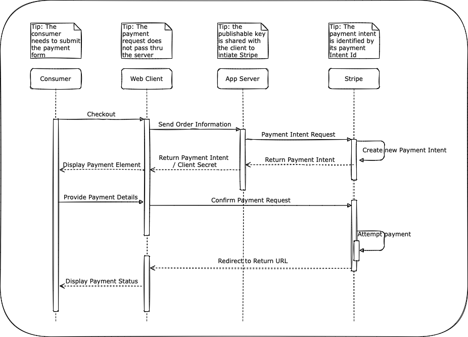

# E-commerce Demo App Using Stripe Elements

## Description

This is a simple e-commerce demo application that a customer can use to purchase a book, using Stripe Elements.

## Application overview

This demo is written in Javascript (Node.js) with the [Express framework](https://expressjs.com/). You'll need to retrieve a set of testmode API keys from the Stripe dashboard (you can create a free test account [here](https://dashboard.stripe.com/register)) to run this locally.

We're using the [Bootstrap](https://getbootstrap.com/docs/4.6/getting-started/introduction/) CSS framework. It's the most popular CSS framework in the world and is pretty easy to get started with — feel free to modify styles/layout if you like. 

To simplify this project, we're also not using any database here, either. Instead `app.js` includes a simple switch statement to read the GET params for `item`.

This project has been cloned and then modified based this [original](https://github.com/mattmitchell6/sa-takehome-project-node).

## Installation Instructions

To get started, clone the repository and run `npm install` to install dependencies:

```
git clone https://github.com/ManarAbd/sa-takehome-project-node && cd sa-takehome-project-node
npm install
```

Rename `sample.env` to `.env` and populate with Stripe account's test API keys

Then setup Stripe
```
# Install via npm
npm install --save stripe
```

Then run the application locally:

```
npm start
```

Navigate to [http://localhost:3000](http://localhost:3000) to view the index page.

---

# Architecture Review

## Overview

In this demo, we will showcase the usage of Stripe Elements to enable secure payments via web or mobile interface.

[Stripe Elements](https://stripe.com/docs/payments/elements) is a set of prebuilt UI components for building a web checkout flow. It’s available as a feature of Stripe.js, a library for building payment flows. Stripe.js tokenizes sensitive payment details within an Element and allow direct payments request to Stripe without passing via a server, which helps with security compliance requirements, like PCI. Some of the characteristics and advantages of Elements are as follow;

- Customizable components
- Save development time
- All in one integrations
- Help Keep Payment safe

Stripe's [Payment Intent](https://stripe.com/docs/api/payment_intents) API enables building integrations that can handle complex asynchronous payment flows. When invoked, it starts by creating a unique payment intent id, and a client secret, that can be further used to generate the payment element and eventually process the payment.

## Approaching the Problem

The design of a secure and reliable e-commerce payment application is complicated by nature. However, the presence of a readily available Stripe plugins and APIs let us focus on integrating the higher level components without worrying about the underlying details. What we need to do first is to identify the role and functions of each component or actor or module (please check the sequence diagram below). Some functional requirements are as follow:

- User selects a book and get directed to a payment page where they expect multiple payment options
- Upon submit, the user is redirected to a payment status page

Some of the non-functional requirements are:

- The e-commerce server should not process card details
- The e-commerce server should authenticate with Stripe first and pass the publishable key to the web client

We are also able to indentify that:

- A payment intent is the first step towards a successful payment
- The payment widget that collects the card data is to be generated by Stripe and loaded dynamically based on the payment intent

As a result, we can proceed to implement the solution by understanding how the payment intent API works and how it interacts with the server and how we can load a payment element into a web page. There is a [very good reference](https://stripe.com/docs/payments/accept-a-payment?ui=elements) on the Stripe documentation website that was used a guideline and starting point for implementing this solution.

## Sequence Diagram

<p align="center">

</p>

## Solution Details

This is a quick steps guides of steps to follow in order to get a payment working in no time!

>Before commencing, we need to have a Stripe account. Luckily Stripe provide a test mode for developers. Connect to [www.stripe.com](http://www.stripe.com) and register a new account, and then note the publishable and secret key as they will be used for authentication.

### Enable Payment Methods (Portal)

One of the advantages of Stripe, and of using the automatic payment method options, is that these are completely customisable from the accounts's [payment method setttings page](https://dashboard.stripe.com/settings/payment_methods). We need some enabled, especially in order to test some card payments.

### Create a Payment Intent (Server Side)

First, don't forget to initialise Stripe!

```Javascript
const stripe = require('stripe')(process.env.STRIPE_SECRET_KEY);
```

We are passing the payment amount to the server, based on the user's choice, and then forwarding the request to Stripe which creates a intent from it. The payment intent contains a client secret that is needed to be returned to the client-side. All this done via the checkout function;

```Javascript
app.get('/checkout', async (req, res) => {
  // Just hardcoding amounts here to avoid using a database
  const item = req.query.item;
  let title, amount, error,client_secret;

//...
//...

   // add payment intent
   const paymentIntent = await stripe.paymentIntents.create({
    amount: amount,
    currency: 'usd',
    automatic_payment_methods: {enabled: true},
    //payment_method_types: ['card'],
   });
   client_secret = paymentIntent.client_secret;

  res.render('checkout', {
    title: title,
    amount: amount,
    error: error,
    client_secret: client_secret
  });
});
```

### Collect Payment Details (Client Side)

The Payment Element is automatically available as a feature of Stripe.js. Include the Stripe.js script on the checkout page by adding it to a script tag. Always load Stripe.js directly from js.stripe.com to remain PCI compliant.
Create a submit form and inside it a div to dynamically load the payment element. We will use asynchronous calls in Javascript to fetch all the needed data, create the payment element and then load it in the div.

```HTML
        <form id="payment-form" data-secret="{{ client_secret }}">
          <div>
            <label for="email">Email address</label>
            <input type="email" class="form-control" id="email" name="email" placeholder="you@email.com">
          </div>
          <div class="mt-20 text-center text-secondary border-placeholder" id="payment-element">
            Add Stripe Element here!
         
          </div>
          <div class="mt-20">
            <button type="submit" class="btn btn-lg btn-block btn-primary">Pay $<span class="amount" data-amount="{{amount}}"></span></button>
          </div>
        </form>
```

checkout.js: get the publishable key. This is needed in order to initiate a new client-side Stripe object from stripe.js

```Javascript
  const response1 = await fetch('/publishable');
  const { publishablekey: publishablekey } = await response1.json();
  const stripe = Stripe(publishablekey);
```  

checkout.js: this step does the magic of rendering the payment form with card issuer information, card number, cvv etc.

```Javascript
  // Render the form using the clientSecret
  const clientSecret = document.getElementById('payment-form').getAttribute('data-secret');

  const elements = stripe.elements({clientSecret});

  // Create and mount the Payment Element
  const paymentElement = await elements.create('payment');
  paymentElement.mount('#payment-element');
```

### Submit the Payment to Stripe (Client Side)

Now that the form data is populated, it's about time for the user to fill their payment details and submit. This operation calls stripe.confirmPayment which submits the request to the Stripe servers, directly from the client side. We also will need to provide the return URL where the user needs to be redirected to.

```Javascript
  form.addEventListener('submit', async (event) => {
    event.preventDefault();

    const {error} = await stripe.confirmPayment({
      //`Elements` instance that was used to create the Payment Element
      elements,
      confirmParams: {
        return_url: 'http://localhost:3000/success',
      },
    });
```

The redirect URL corresponds to a page on our website that provides the status of the payment. 

status.js: retrieve a payment intent based on the client secret and payment intent id, then get the status of that payment and display some information on the redirect URL page.

```Javascript
  stripe.retrievePaymentIntent(clientSecret).then(({paymentIntent}) => {
    const message = document.getElementById('#message')
    //... 
    switch (paymentIntent.status) {
      case 'succeeded':
        message.innerHTML = 'Payment received. ' + 
          '<br />' +
          'Payment Intent ID: ' + paymentIntent.id +
          '<br />' +
          'Payment Amount: $' + ((paymentIntent.amount)/100).toFixed(2) +
          '<br />'

        break;
```

## Further Enhancing the Solution

There are multiple enhancements to render this solution more robust. As we were focusing only on the happy path for credit card payment, we would need to enhance the solution further to take into consideration the unhappy path, which includes failure and pending transactions that not yet processed.